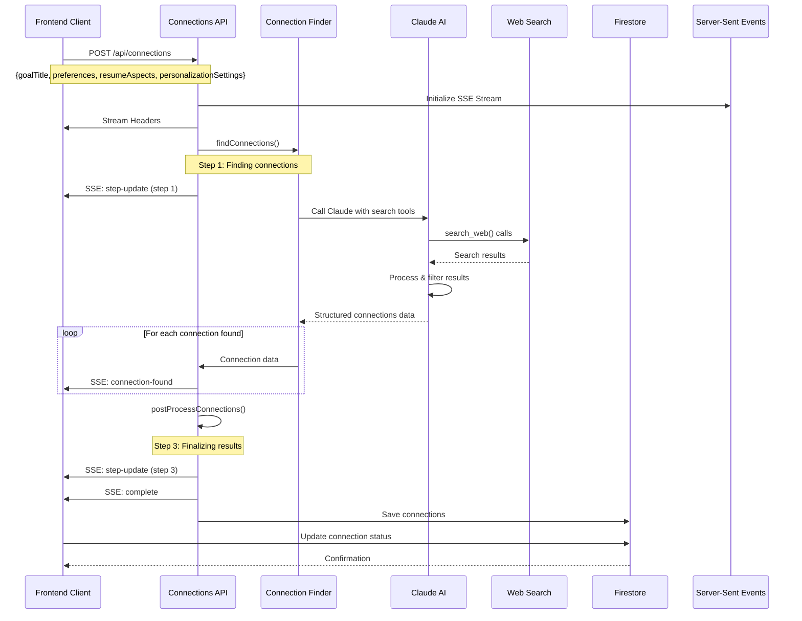

# API Flow Documentation

This document details the API request/response flows, particularly focusing on the Server-Sent Events (SSE) streaming process for real-time connection finding.

## Connection Finding API Flow



## API Endpoints

### POST /api/connections

**Purpose**: Find professional connections based on user goals and resume data.

**Request Format**:
```typescript
{
  goalTitle: string;                    // User's career goal
  preferences: {                       // Search preferences
    programs: boolean;
    connections: boolean;
  };
  userId: string;                      // Firebase user ID
  race?: string;                       // Optional demographic info
  location?: string;                   // User location
  resumeAspects: ResumeAspects;       // Structured resume data
  rawResumeText: string;              // Raw resume text
  personalizationSettings?: {         // Personalization config
    enabled: boolean;
    professionalInterests: string;
    personalInterests: string;
  };
}
```

**Response Format**: Server-Sent Events stream with multiple event types:

1. **step-update**: Progress updates
```typescript
{
  type: "step-update";
  step: number;                        // Current step (0-3)
  message: string;                     // Human-readable status
}
```

2. **connection-found**: Individual connections as discovered
```typescript
{
  type: "connection-found";
  connection: Connection;              // Full connection object
  count: number;                       // Current count
  total: number;                       // Expected total
}
```

3. **complete**: Final results
```typescript
{
  type: "complete";
  data: {
    connections: ProcessedConnection[]; // Final processed connections
    aspects: ResumeAspects;            // Resume analysis
    goalTitle: string;                 // Original goal
    timestamp: string;                 // Completion time
    status: "success";
  };
}
```

4. **error**: Error handling
```typescript
{
  type: "error";
  message: string;                     // Error description
  code?: string;                       // Error code
  step?: number;                       // Step where error occurred
}
```

### POST /api/resume-analysis

**Purpose**: Analyze and extract structured data from resume uploads.

**Request Format**:
```typescript
{
  userId: string;                      // Firebase user ID
  resumeText: string;                  // Raw resume text
  fileName?: string;                   // Original filename
}
```

**Response Format**:
```typescript
{
  success: boolean;
  data: {
    structuredData: ResumeAspects;     // Extracted resume aspects
    rawText: string;                   // Cleaned text
    metadata: {
      wordCount: number;
      sections: string[];              // Detected sections
      extractionTime: number;          // Processing time (ms)
    };
  };
  error?: string;                      // Error message if failed
}
```

## Server-Sent Events (SSE) Implementation

### Connection Establishment

```typescript
// Client-side SSE connection
const eventSource = new EventSource('/api/connections', {
  withCredentials: true
});

eventSource.onmessage = (event) => {
  const data = JSON.parse(event.data);
  
  switch (data.type) {
    case 'step-update':
      updateProgress(data.step, data.message);
      break;
      
    case 'connection-found':
      addConnection(data.connection);
      break;
      
    case 'complete':
      finalizeResults(data.data.connections);
      eventSource.close();
      break;
      
    case 'error':
      handleError(data.message);
      eventSource.close();
      break;
  }
};
```

### Server-side SSE Implementation

```typescript
// SSE message sending utility
const sendSSE = (data: any) => {
  if (!streamClosed) {
    controller.enqueue(
      encoder.encode(`data: ${JSON.stringify(data)}\n\n`)
    );
  }
};

// Progress updates
sendSSE({
  type: 'step-update',
  step: 1,
  message: 'Finding connections...'
});

// Individual connections
found.forEach((connection, index) => {
  sendSSE({
    type: 'connection-found',
    connection,
    count: index + 1,
    total: found.length
  });
});

// Final completion
sendSSE({
  type: 'complete',
  data: {
    connections: processed,
    aspects,
    goalTitle,
    timestamp: new Date().toISOString(),
    status: 'success'
  }
});
```

## AI Integration Flow

### Tool-based AI Interactions

The system uses Claude AI with tool calling capabilities for web search:

```typescript
// AI tool configuration
const tools = [
  {
    type: 'function',
    name: 'search_web',
    description: 'Search the internet for relevant information',
    parameters: {
      type: 'object',
      properties: {
        query: {
          type: 'string',
          description: 'Search query for finding connections'
        }
      },
      required: ['query']
    }
  }
];

// AI call with exponential backoff
const response = await withExponentialBackoff(() =>
  callClaude(prompt, {
    tools,
    maxTokens: 15000,
    model: 'gpt-4.1'
  })
);
```

### AI Processing Steps

1. **Goal Analysis**: AI analyzes user goals and resume data
2. **Search Strategy**: AI formulates targeted search queries
3. **Web Search**: Multiple search calls for comprehensive data
4. **Result Processing**: AI filters and validates found connections
5. **Personalization**: AI matches professional and personal interests
6. **Outreach Generation**: AI creates personalized outreach messages

## Error Handling

### Rate Limiting

```typescript
// Exponential backoff for rate limits
async function withExponentialBackoff<T>(
  operation: () => Promise<T>,
  maxRetries: number = 3,
  baseDelay: number = 1000
): Promise<T> {
  for (let attempt = 0; attempt <= maxRetries; attempt++) {
    try {
      return await operation();
    } catch (error) {
      if (isRateLimit(error) && attempt < maxRetries) {
        const delay = baseDelay * Math.pow(2, attempt) + Math.random() * 1000;
        await sleep(delay);
        continue;
      }
      throw error;
    }
  }
}
```

### Error Types

- **Validation Errors**: Invalid input data (400)
- **Authentication Errors**: Invalid or expired tokens (401)
- **Rate Limit Errors**: Too many requests (429)
- **AI Service Errors**: External API failures (502)
- **Processing Errors**: Internal processing failures (500)

## Performance Considerations

### Caching Strategy

- **Resume Analysis**: Cache structured data for 24 hours
- **Search Results**: Cache web search results for 1 hour
- **AI Responses**: Cache similar prompts for 30 minutes

### Optimization Techniques

- **Parallel Processing**: Multiple AI calls for different aspects
- **Stream Processing**: Results sent as they're found
- **Lazy Loading**: Components loaded on demand
- **Request Debouncing**: Prevent duplicate API calls

## Security Measures

### Authentication

```typescript
// Firebase token verification
const verifyToken = async (token: string) => {
  try {
    const decodedToken = await admin.auth().verifyIdToken(token);
    return decodedToken.uid;
  } catch (error) {
    throw new Error('Invalid authentication token');
  }
};
```

### Input Validation

```typescript
// Zod schema validation
const ConnectionRequestSchema = z.object({
  goalTitle: z.string().min(5).max(200),
  preferences: z.object({
    programs: z.boolean(),
    connections: z.boolean()
  }),
  userId: z.string().uuid(),
  personalizationSettings: z.object({
    enabled: z.boolean(),
    professionalInterests: z.string().max(500),
    personalInterests: z.string().max(500)
  }).optional()
});
```

## API Rate Limits

| Endpoint | Rate Limit | Window |
|----------|------------|--------|
| `/api/connections` | 10 requests | 1 hour |
| `/api/resume-analysis` | 5 requests | 1 hour |
| `/api/user-data` | 100 requests | 1 hour |

---

**Next Steps**:
- Review [Database Schema](./database-schema.md) for data structure details
- Check [Connection Finding Process](../features/connection-finding.md) for workflow details