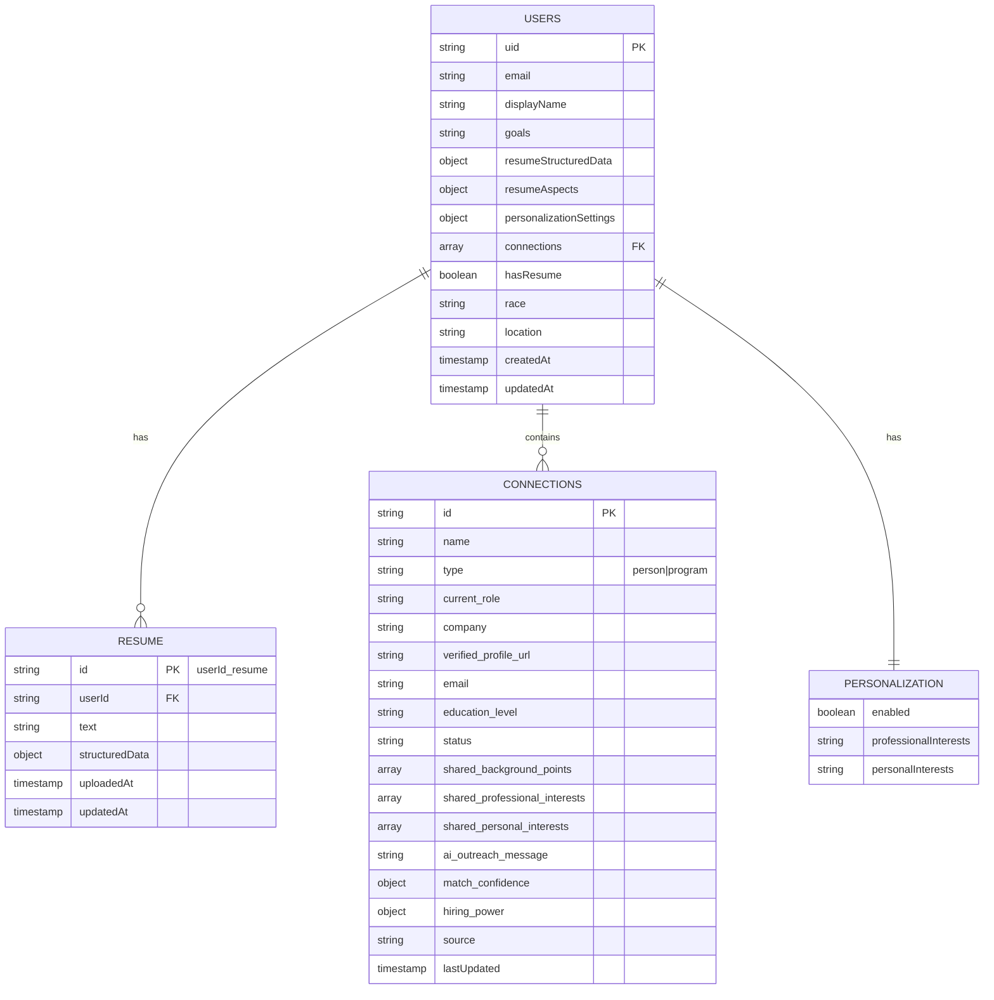

# Database Schema Documentation

This document details the Firebase Firestore database schema, including collections, document structures, and relationships.

## Database Schema Overview



## Collections

### 1. Users Collection (`/users/{uid}`)

**Primary Collection**: Stores user profile and aggregated data.

```typescript
interface UserDocument {
  // Identity
  uid: string;                         // Firebase UID (document ID)
  email: string;                       // User email
  displayName: string;                 // Display name
  
  // Profile Data
  goals: string;                       // Career goals
  race?: string;                       // Optional demographic
  location?: string;                   // User location
  hasResume: boolean;                  // Resume upload status
  
  // Resume Data (denormalized for quick access)
  resumeStructuredData?: object;       // Parsed resume data
  resumeAspects?: ResumeAspects;      // AI-extracted aspects
  
  // Personalization
  personalizationSettings: {
    enabled: boolean;                  // Feature enabled
    professionalInterests: string;    // Professional interests
    personalInterests: string;        // Personal hobbies/interests
  };
  
  // Connections (embedded array)
  connections: Connection[];           // User's connections
  
  // Metadata
  createdAt: Timestamp;               // Account creation
  updatedAt: Timestamp;               // Last update
}
```

**Indexes**:
- `email` (ascending)
- `createdAt` (descending)
- `hasResume` (ascending)

### 2. Resume Subcollection (`/users/{uid}/resume/{resumeId}`)

**Purpose**: Stores detailed resume data separately for performance.

```typescript
interface ResumeDocument {
  id: string;                         // Document ID (userId_resume)
  userId: string;                     // Reference to user
  
  // Raw Data
  text: string;                       // Original resume text
  fileName?: string;                  // Original filename
  
  // Processed Data
  structuredData: {
    sections: {
      [key: string]: string;          // Section content
    };
    extractedInfo: {
      name?: string;
      email?: string;
      phone?: string;
      skills: string[];
      education: EducationEntry[];
      experience: ExperienceEntry[];
    };
  };
  
  // Metadata
  uploadedAt: Timestamp;              // Upload time
  updatedAt: Timestamp;               // Last processing
  processingStatus: 'pending' | 'completed' | 'failed';
}
```

## Document Structures

### Connection Document Structure

```typescript
interface Connection {
  // Identity
  id: string;                         // Unique connection ID
  type: 'person' | 'program';        // Connection type
  name: string;                       // Connection name
  
  // Professional Info (for person type)
  current_role?: string;              // Current position
  company?: string;                   // Company name
  education_level?: 'undergraduate' | 'graduate' | 'postgraduate';
  
  // Program Info (for program type)
  organization?: string;              // Program organization
  program_type?: string;              // Program category
  program_description?: string;       // Program details
  
  // Contact Information
  verified_profile_url?: string;      // LinkedIn/professional URL
  email?: string;                     // Contact email
  website_url?: string;               // Program/personal website
  
  // Matching Data
  direct_matches?: string[];          // Direct background matches
  goal_alignment?: string;            // How connection aligns with goals
  shared_background_points?: string[]; // Shared experiences
  
  // Personalization Features
  shared_professional_interests?: string[]; // Shared professional interests
  shared_personal_interests?: string[];     // Shared personal interests
  ai_outreach_message?: string;       // Generated outreach message
  
  // Metadata
  source?: string;                    // Original source URL
  match_confidence?: {
    name?: number;                    // Name match confidence
    role?: number;                    // Role match confidence
    company?: number;                 // Company match confidence
    overall?: number;                 // Overall match score
  };
  
  // User Management
  status: 'not_contacted' | 'email_sent' | 'response_received' | 
          'meeting_scheduled' | 'rejected' | 'ghosted' | 'internship_acquired';
  lastUpdated: Timestamp;             // Last status change
}
```

### Resume Aspects Structure

```typescript
interface ResumeAspects {
  // Education
  education: {
    institutions: string[];           // School names
    current_level: 'high_school' | 'undergraduate' | 'graduate';
    fields_of_study: string[];       // Majors/fields
    graduation_years: string[];      // Graduation years
  };
  
  // Work Experience
  work_experience: {
    detailed_experiences: {
      company: string;                // Company name
      role: string;                   // Position title
      duration: string;               // Time period
      responsibilities: string[];     // Key responsibilities
      scale_and_impact: string;       // Impact description
      key_achievements: string[];     // Notable achievements
    }[];
    companies: string[];              // Company names (legacy)
    startup_experience: string[];    // Startup-specific experience
    industry_transitions?: {
      from_industries: string[];      // Previous industries
      to_industries: string[];       // Target industries
      transition_context: string;    // Transition narrative
    };
  };
  
  // Activities & Involvement
  activities?: {
    organizations: string[];          // Organizations/clubs
    clubs: string[];                 // Student clubs
    volunteer_work: string[];        // Volunteer activities
  };
  
  // Achievements
  achievements?: {
    certifications: string[];        // Professional certifications
    awards: string[];                // Awards received
    notable_projects: string[];      // Significant projects
  };
  
  // Growth Areas
  growth_areas?: {
    developing_skills: string[];     // Skills being developed
    target_roles: string[];          // Desired positions
    learning_journey: string;        // Learning narrative
  };
  
  // Interests (for personalization)
  professional_interests?: string;   // Professional passions
  personal_interests?: string;       // Personal hobbies/interests
}
```

## Data Relationships

### User → Connections
- **Type**: One-to-many (embedded array)
- **Purpose**: Store user's discovered connections
- **Access Pattern**: Load all connections with user profile
- **Update Pattern**: Append new connections, update status individually

### User → Resume
- **Type**: One-to-one (subcollection)
- **Purpose**: Separate large resume data for performance
- **Access Pattern**: Load on-demand for resume analysis
- **Update Pattern**: Replace entire document on new upload

### Connection → External Sources
- **Type**: Reference (URL-based)
- **Purpose**: Link to original data sources
- **Validation**: URL format validation
- **Caching**: Source data cached for performance

## Indexing Strategy

### Composite Indexes

```typescript
// User connections by status and date
{
  collection: 'users',
  fields: [
    { field: 'connections.status', order: 'ascending' },
    { field: 'connections.lastUpdated', order: 'descending' }
  ]
}

// Connections by type and match confidence
{
  collection: 'users',
  fields: [
    { field: 'connections.type', order: 'ascending' },
    { field: 'connections.match_confidence.overall', order: 'descending' }
  ]
}
```

### Single Field Indexes

- `users.email` (ascending) - User lookup
- `users.hasResume` (ascending) - Resume filtering
- `users.createdAt` (descending) - Recent users
- `users.personalizationSettings.enabled` (ascending) - Feature usage

## Security Rules

### Firestore Security Rules

```javascript
rules_version = '2';
service cloud.firestore {
  match /databases/{database}/documents {
    // Users can only access their own data
    match /users/{userId} {
      allow read, write: if request.auth != null && request.auth.uid == userId;
      
      // Resume subcollection
      match /resume/{resumeId} {
        allow read, write: if request.auth != null && request.auth.uid == userId;
      }
    }
    
    // Public read access for certain metadata (if needed)
    match /metadata/{document} {
      allow read: if request.auth != null;
      allow write: if false; // Admin only
    }
  }
}
```

## Data Migration Considerations

### Schema Evolution

1. **Additive Changes**: New fields added with default values
2. **Field Renaming**: Gradual migration with dual-write period
3. **Type Changes**: Migration functions for data transformation
4. **Deprecation**: Gradual removal with deprecation warnings

### Migration Scripts

```typescript
// Example migration for personalization features
async function migratePersonalizationSettings() {
  const users = await db.collection('users').get();
  
  const batch = db.batch();
  users.docs.forEach(doc => {
    if (!doc.data().personalizationSettings) {
      batch.update(doc.ref, {
        personalizationSettings: {
          enabled: false,
          professionalInterests: '',
          personalInterests: ''
        }
      });
    }
  });
  
  await batch.commit();
}
```

## Performance Optimization

### Read Optimization
- **Denormalization**: Frequently accessed data embedded in user document
- **Pagination**: Large connection lists paginated
- **Caching**: Client-side caching for static data

### Write Optimization
- **Batch Writes**: Multiple connection updates in single batch
- **Selective Updates**: Only update changed fields
- **Offline Support**: Local writes with eventual consistency

## Backup and Recovery

### Automated Backups
- **Daily Snapshots**: Complete database backup daily
- **Point-in-time Recovery**: Recovery to specific timestamp
- **Cross-region Replication**: Disaster recovery setup

### Data Export
- **User Data Export**: GDPR compliance export functionality
- **Analytics Export**: Data export for analysis
- **Migration Export**: Schema migration support

---

**Next Steps**:
- Review [Connection Finding Process](../features/connection-finding.md) for workflow details
- Check [API Documentation](./api-flow.md) for data access patterns