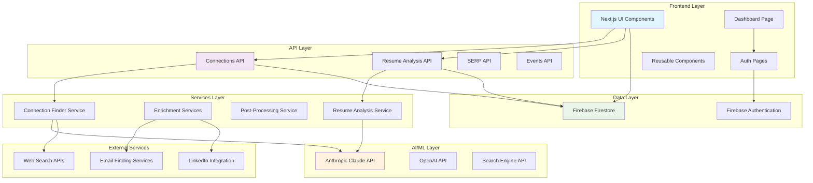

# System Architecture Overview

This document provides a high-level overview of the AI Internship Finder system architecture, showing the main components and their relationships.

## Architecture Diagram

## System Layers

### 1. Frontend Layer
**Technology**: Next.js 14, React, TypeScript, Tailwind CSS

- **UI Components**: Reusable React components with modern design
- **Dashboard Page**: Main interface for connection finding and management
- **Auth Pages**: User authentication and registration flows
- **Responsive Design**: Mobile-first approach with adaptive layouts

### 2. API Layer
**Technology**: Next.js API Routes, Server-Sent Events

- **Connections API**: Core endpoint for finding and managing connections
- **Resume Analysis API**: Automated resume parsing and analysis
- **SERP API**: Web search integration for real-time data
- **Events API**: Real-time updates via Server-Sent Events

### 3. Services Layer
**Technology**: TypeScript services with dependency injection

- **Connection Finder Service**: AI-powered connection discovery
- **Enrichment Services**: Profile and contact information enhancement
- **Post-Processing Service**: Data transformation and validation
- **Resume Analysis Service**: Structured data extraction from resumes

### 4. AI/ML Layer
**Technology**: Anthropic Claude, OpenAI GPT models

- **Claude API**: Primary AI agent for connection finding and analysis
- **OpenAI API**: Secondary AI services for specific tasks
- **Search Engine API**: Web search capabilities for real-time data

### 5. Data Layer
**Technology**: Firebase Firestore, Firebase Authentication

- **Firestore**: NoSQL document database for flexible data storage
- **Firebase Auth**: Secure user authentication and session management
- **Real-time Updates**: Live data synchronization across clients

### 6. External Services
**Technology**: Various APIs and integrations

- **Web Search APIs**: Perplexity and other search providers
- **Email Finding Services**: Contact information discovery
- **LinkedIn Integration**: Professional profile data (when available)

## Key Architectural Principles

### 1. Layered Architecture
- Clear separation of concerns between layers
- Each layer has specific responsibilities
- Dependencies flow downward through layers

### 2. Microservices Pattern
- Services are loosely coupled and independently deployable
- Each service handles a specific domain
- API-first design for service communication

### 3. Real-time Updates
- Server-Sent Events for live progress tracking with granular step updates
- Instant connection streaming as connections are discovered
- Inline progress loader with side-by-side UI layout
- Duplicate prevention during streaming process
- Responsive user experience with immediate feedback

### 4. AI-First Design
- AI agents as core system components
- Tool-based AI interactions with web search
- Iterative AI processing with retry logic

### 5. Scalable Data Storage
- NoSQL design for flexible schema evolution
- Document-based storage for complex data structures
- Firebase scaling and performance optimization

## Data Flow Summary

1. **User Input**: Goals, resume, and preferences entered through UI
2. **Immediate UI Updates**: Search bar repositioning and inline loader activation
3. **AI Processing**: Claude agents analyze data and search for connections iteratively
4. **Real-time Streaming**: Each connection streamed immediately with temporary ID
5. **Live UI Updates**: Connections appear in grid as they're discovered
6. **Progress Tracking**: Granular step updates (Finding 1st, 2nd, 3rd... connection)
7. **Web Search**: Real-time web searches for current information per connection
8. **Data Enhancement**: Profile enrichment and validation for final connections
9. **Database Storage**: Final processed connections saved to Firestore (no duplicates)
10. **Complete Experience**: Side-by-side view of connections + progress loader

## Security Considerations

- **Authentication**: Firebase Auth with secure token validation
- **Authorization**: Role-based access control for API endpoints
- **Data Privacy**: Secure handling of resume and personal data
- **API Security**: Rate limiting and input validation
- **External API**: Secure key management for third-party services

## UI/UX Improvements

### Enhanced Connection Discovery Experience

**Inline Progress Tracking**:
- Side-by-side layout during connection finding
- Real-time progress loader with connection-specific steps
- Connections grid updates immediately as connections are found
- No blocking full-screen overlays during search

**MultiStepLoader Enhancements**:
- `inline` mode for non-intrusive progress display
- Granular step tracking: "Finding 1st connection", "Finding 2nd connection", etc.
- Fixed positioning to prevent header text overlap
- Responsive design for different screen sizes

**State Management Improvements**:
- Immediate search bar repositioning when search starts
- Preserved checkbox states (Programs/People preferences)
- Unique keys for connection lists to prevent React warnings
- Duplicate prevention in both UI and database layers

**Streaming Architecture Benefits**:
- Connections appear as soon as they're discovered (not waiting for all 5)
- User sees immediate progress instead of long loading times
- Better perceived performance and user engagement
- Clear visual feedback about the AI process

## Performance Optimizations

- **Caching**: Intelligent caching of AI responses and search results
- **Lazy Loading**: Component and data loading on demand
- **Pagination**: Efficient handling of large connection lists
- **Debouncing**: Input debouncing for search and filters
- **CDN**: Static asset delivery via Vercel Edge Network
- **Streaming**: Real-time data delivery reduces perceived latency
- **Duplicate Prevention**: Efficient deduplication prevents unnecessary renders

## Monitoring and Observability

- **Error Tracking**: Comprehensive error logging and reporting
- **Performance Metrics**: Response time and throughput monitoring
- **AI Usage**: Token usage and cost tracking
- **User Analytics**: Usage patterns and feature adoption
- **System Health**: Uptime and availability monitoring

---

**Next Steps**: 
- Review [API Flow Documentation](./api-flow.md) for detailed request/response patterns
- Check [Database Schema](./database-schema.md) for data structure details