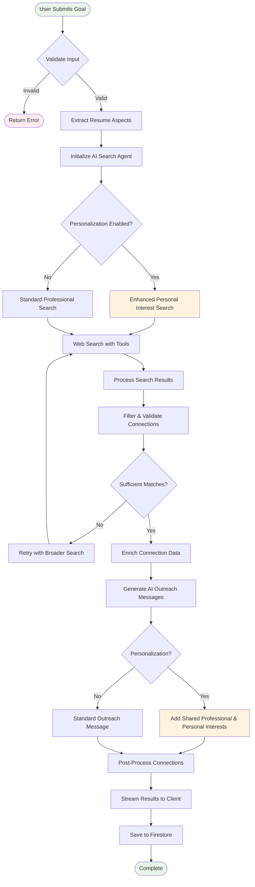

# Connection Finding Process

This document details the AI-driven connection finding workflow, including the step-by-step process, decision points, and personalization features.

## Process Overview



## Detailed Process Steps

### Step 1: Input Validation and Analysis

**Purpose**: Validate user input and prepare resume data for AI processing.

**Input Processing**:
```typescript
interface ConnectionRequest {
  goalTitle: string;                    // Career goal (required)
  preferences: {                       // Search preferences
    programs: boolean;                 // Include programs/internships
    connections: boolean;              // Include people connections
  };
  resumeAspects: ResumeAspects;       // Structured resume data
  personalizationSettings?: {         // Optional personalization
    enabled: boolean;
    professionalInterests: string;
    personalInterests: string;
  };
  race?: string;                      // Optional demographic info
  location?: string;                  // User location
}
```

**Validation Rules**:
- Goal title: 5-200 characters, meaningful career objective
- Resume aspects: Must contain education and work experience
- Personalization: If enabled, interests must be non-empty
- User authentication: Valid Firebase token required

### Step 2: AI Search Agent Initialization

**Purpose**: Configure AI agent with appropriate context and tools.

**AI Configuration**:
```typescript
const tools = [
  {
    type: 'function',
    name: 'search_web',
    description: 'Search the internet for relevant connections',
    parameters: {
      type: 'object',
      properties: {
        query: {
          type: 'string',
          description: 'Search query for finding people/programs'
        }
      },
      required: ['query']
    }
  }
];

const prompt = buildConnectionFinderPrompt({
  goalTitle,
  connectionAspects,
  preferences,
  race,
  location,
  personalizationSettings
});
```

**Prompt Enhancement**:
- **Basic Mode**: Professional background matching only
- **Personalized Mode**: Includes personal interest searches and enhanced matching

### Step 3: Multi-Step Search Strategy

#### 3.1 Goal Analysis and Background Prioritization

**Purpose**: Identify high-potential networking opportunities from user's background.

**Prioritization Criteria**:
1. **Large Companies**: Fortune 500, big tech companies (high networking potential)
2. **Team-based Work**: Collaborative experiences with many colleagues
3. **Established Institutions**: Universities, government agencies, large nonprofits
4. **Company Maturity**: Established companies (100+ employees) over startups

**Background Analysis**:
```typescript
interface PriorityExperience {
  company: string;
  networkingPotential: 'high' | 'medium' | 'low';
  employeeCount: number;
  collaborationLevel: 'individual' | 'team' | 'leadership';
  connectionTypes: string[];           // Types of connections available
}
```

#### 3.2 Targeted Discovery

**Search Strategies**:

1. **Company + Role Searches**:
   ```
   "AI engineer LinkedIn Google"
   "machine learning intern Meta"
   "investment banker Goldman Sachs LinkedIn"
   ```

2. **University-Specific Searches**:
   ```
   "UIUC alumni Google"
   "Harvard alumni Goldman Sachs"
   "Stanford finance LinkedIn"
   ```

3. **Program Searches** (when enabled):
   ```
   "Google internship program 2025"
   "Meta AI fellowship"
   "Goldman Sachs analyst program"
   ```

#### 3.3 Personalized Filtering (when enabled)

**Enhanced Search Queries**:
```typescript
const personalizedSearches = [
  `${personName} Instagram`,           // Personal interests
  `${personName} Twitter`,             // Opinions and interests
  `${personName} personal blog`,       // Personal writing
  `${personName} GitHub`,              // Technical interests
  `${personName} volunteer`,           // Charitable interests
  `${personName} hobby`,               // Personal activities
  `${personName} speaking`,            // Professional passions
];
```

**Interest Matching**:
- Match professional interests from personalization settings
- Find shared personal hobbies and activities
- Identify common volunteer work or causes
- Discover shared educational backgrounds

### Step 4: Result Processing and Validation

#### 4.1 Quality Filtering

**Connection Quality Criteria**:
- **Direct Background Matches**: Same companies, schools, organizations
- **Goal Alignment**: Clear relevance to user's career objectives
- **Verified Contact Information**: Valid LinkedIn/professional profiles
- **Accessibility**: Avoid celebrities or extremely senior executives

**Validation Process**:
```typescript
interface ValidationCriteria {
  hasDirectMatch: boolean;             // Shared background element
  goalRelevance: number;               // 0-100 alignment score
  contactVerified: boolean;            // Valid contact information
  accessibilityLevel: 'high' | 'medium' | 'low';
  sourceQuality: 'verified' | 'inferred' | 'uncertain';
}
```

#### 4.2 Enrichment and Enhancement

**Data Enrichment**:
- Profile validation and completion
- Contact information discovery
- Background verification
- Interest alignment scoring

**Professional Interest Matching**:
```typescript
interface InterestMatch {
  userInterest: string;                // User's stated interest
  connectionInterest: string;          // Connection's discovered interest
  matchStrength: number;               // 0-100 similarity score
  evidence: string[];                  // Supporting evidence
}
```

### Step 5: AI Outreach Generation

#### 5.1 Message Personalization

**Standard Outreach Elements**:
- Specific company names (not generic terms)
- Shared background references
- Clear career goal mention
- Professional expertise acknowledgment

**Enhanced Outreach (with personalization)**:
- Shared professional interests
- Common personal hobbies/activities
- Activity-based call-to-action
- Natural conversation starters

**Example Enhanced Message**:
```
"Hey Sarah! Saw you're at OpenAI now - that's awesome! I'm a UIUC CS 
student (go Illini!) looking for AI internships and noticed we both love 
rock climbing from your posts. Want to go rock climbing together sometime 
and chat about your path from Microsoft to OpenAI?"
```

#### 5.2 Call-to-Action Logic

**Call-to-Action Selection**:
- **Shared Personal Interests**: Activity-based meeting
  - "grab coffee and talk hiking"
  - "quick climbing session"
  - "volunteer event together"
- **No Shared Interests**: Professional meeting
  - "15-minute chat"
  - "brief call"
  - "quick coffee"

### Step 6: Post-Processing and Delivery

#### 6.1 Data Transformation

**ProcessedConnection Structure**:
```typescript
interface ProcessedConnection {
  // Basic info preserved
  id: string;
  name: string;
  type: 'person' | 'program';
  
  // Enhanced with personalization
  shared_professional_interests: string[];
  shared_personal_interests: string[];
  ai_outreach_message: string;
  
  // Match scoring
  matchPercentage: number;
  description: string;
}
```

#### 6.2 Real-time Streaming

**Enhanced Server-Sent Events Flow**:
1. **step-update**: Granular progress notifications for each connection
2. **connection-found**: Individual connections streamed as discovered
3. **complete**: Final processed results for persistence

**Improved Streaming Architecture**:

*Connection Generation Process*:
- Connections are generated iteratively (1-5 connections)
- Each connection is streamed immediately when found
- Progress updates track specific connection numbers
- Final results contain post-processed data for database storage

*Step Updates*:
```typescript
// Granular progress tracking
{ type: 'step-update', step: 0, message: 'Analyzing your background' }
{ type: 'step-update', step: 1, message: 'Finding 1st connection' }
{ type: 'step-update', step: 2, message: 'Finding 2nd connection' }
{ type: 'step-update', step: 3, message: 'Finding 3rd connection' }
{ type: 'step-update', step: 4, message: 'Finding 4th connection' }
{ type: 'step-update', step: 5, message: 'Finding 5th connection' }
{ type: 'step-update', step: 6, message: 'Processing results' }
```

**Client-side Processing**:
```typescript
eventSource.onmessage = (event) => {
  const data = JSON.parse(event.data);
  
  switch (data.type) {
    case 'step-update':
      // Update inline progress loader
      setCurrentConnectionStepIndex(data.step);
      break;
      
    case 'connection-found':
      // Add connection to UI immediately with temporary ID
      setConnections(prev => {
        const existingIds = new Set(prev.map(c => c.id));
        if (!existingIds.has(data.connection.id)) {
          return [...prev, data.connection];
        }
        return prev;
      });
      break;
      
    case 'complete':
      // Save final processed connections to database only
      // (UI already updated during streaming)
      saveConnectionsToFirestore(data.data.connections);
      break;
  }
};
```

**Duplicate Prevention**:
- Streaming connections use temporary IDs (`temp-person-name-timestamp`)
- Final connections use permanent IDs (`person-name-company-timestamp`)
- UI only updates during streaming to prevent duplicates
- Database receives final processed connections for persistence

**UI/UX Improvements**:
- Inline progress loader shows connection-specific steps
- Connections appear immediately as they're found
- No full-screen overlay during search
- Side-by-side layout: connections grid + progress tracker
- Real-time feedback with granular progress updates

## Personalization Features

### Professional Interest Matching

**Matching Algorithm**:
1. Extract professional interests from personalization settings
2. Search for connections with similar professional passions
3. Score matches based on semantic similarity
4. Include top matches in `shared_professional_interests` array

**Example Matches**:
- User: "AI research, machine learning applications"
- Connection: "Deep learning research, computer vision applications"
- Match: "AI research applications, machine learning"

### Personal Interest Matching

**Discovery Process**:
1. Search social media and personal profiles
2. Identify hobbies, volunteer work, activities
3. Match against user's personal interests
4. Generate conversation starters

**Example Matches**:
- User: "rock climbing, hiking, photography"
- Connection: "bouldering, mountain photography, outdoor adventures"
- Match: "Rock climbing, outdoor photography"

## Error Handling and Retry Logic

### Exponential Backoff

**Rate Limit Handling**:
```typescript
async function withExponentialBackoff<T>(
  operation: () => Promise<T>,
  maxRetries: number = 3,
  baseDelay: number = 1000
): Promise<T> {
  for (let attempt = 0; attempt <= maxRetries; attempt++) {
    try {
      return await operation();
    } catch (error) {
      if (isRateLimit(error) && attempt < maxRetries) {
        const delay = baseDelay * Math.pow(2, attempt) + Math.random() * 1000;
        await sleep(delay);
        continue;
      }
      throw error;
    }
  }
}
```

### Search Quality Assurance

**Quality Checks**:
- Minimum connection threshold (3-5 quality matches)
- Retry with broader search terms if insufficient results
- Fallback to standard search if personalized search fails
- Maximum iteration limit to prevent infinite loops

## Performance Optimization

### Parallel Processing

**Concurrent Operations**:
- Multiple AI search calls for different aspects
- Parallel web searches for various query types
- Concurrent profile enrichment for found connections

### Caching Strategy

**Cache Levels**:
- **Search Results**: 1 hour cache for web search results
- **AI Responses**: 30 minutes cache for similar prompts
- **Profile Data**: 24 hours cache for profile information

### Memory Management

**Resource Optimization**:
- Stream processing to reduce memory usage
- Lazy loading of non-essential data
- Garbage collection of intermediate results

---

**Next Steps**:
- Review [Personalization Features](./personalization.md) for detailed personalization workflow
- Check [API Flow](../architecture/api-flow.md) for technical implementation details