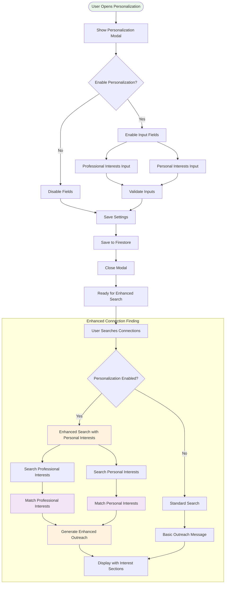

# Personalization Features

This document details the personalization system that enhances connection finding through shared professional and personal interests, creating more meaningful networking opportunities and personalized outreach messages.

## Personalization Flow Overview



## Core Components

### 1. Personalization Settings

**Data Structure**:
```typescript
interface PersonalizationSettings {
  enabled: boolean;                    // Feature toggle
  professionalInterests: string;      // Professional passions/interests
  personalInterests: string;          // Personal hobbies/activities
}
```

**Configuration Interface**:
- **Toggle Switch**: Enable/disable personalization features
- **Professional Interests Field**: Free-form text for work-related passions
- **Personal Interests Field**: Free-form text for hobbies and personal activities
- **Auto-save**: Settings saved to Firebase on change

**Example Settings**:
```typescript
{
  enabled: true,
  professionalInterests: "AI research, machine learning applications, product management, startup innovation",
  personalInterests: "rock climbing, photography, hiking, volunteer work at animal shelters"
}
```

### 2. Enhanced AI Search

**AI Prompt Enhancement**:
When personalization is enabled, the AI receives additional context and instructions:

```typescript
// Enhanced prompt section for personalization
const personalizationContext = `
- User's Professional Interests: ${settings.professionalInterests}
- User's Personal Interests: ${settings.personalInterests}
- MANDATORY: Search for personal interests, hobbies, volunteer work
- MANDATORY: Generate shared_professional_interests and shared_personal_interests
`;
```

**Additional Search Queries**:
```typescript
const personalizedSearches = [
  `${personName} Instagram`,           // Personal interests discovery
  `${personName} Twitter`,             // Personal opinions and interests  
  `${personName} personal blog`,       // Personal writing and interests
  `${personName} GitHub`,              // Technical interests and projects
  `${personName} volunteer`,           // Charitable interests and causes
  `${personName} hobby`,               // Personal activities and hobbies
  `${personName} speaking`,            // Professional passions and expertise
];
```

### 3. Interest Matching Algorithm

#### Professional Interest Matching

**Matching Process**:
1. **Extract Keywords**: Parse user's professional interests into key terms
2. **Search Context**: Look for professional activities, speaking engagements, publications
3. **Semantic Matching**: Use AI to find conceptually similar interests
4. **Relevance Scoring**: Score matches based on semantic similarity and evidence

**Example Matching**:
```typescript
// User Input
professionalInterests: "AI research, machine learning applications, startup innovation"

// Connection Discovery
connectionInterests: [
  "Deep learning research at Stanford AI Lab",
  "Machine learning applications in healthcare",
  "AI startup advisor and investor"
]

// Generated Match
shared_professional_interests: [
  "AI research and deep learning",
  "Machine learning applications",
  "Startup innovation and advising"
]
```

#### Personal Interest Matching

**Discovery Sources**:
- Social media profiles (Instagram, Twitter)
- Personal websites and blogs
- Speaking engagements and conferences
- Volunteer work and charitable activities
- Hobby-related content and communities

**Matching Algorithm**:
```typescript
interface PersonalInterestMatch {
  userInterest: string;                // User's stated interest
  connectionEvidence: string[];        // Found evidence
  matchStrength: number;               // 0-100 confidence score
  conversationStarter: string;        // Generated talking point
}
```

**Example Matching**:
```typescript
// User Input
personalInterests: "rock climbing, photography, hiking, volunteer work"

// Connection Discovery
connectionEvidence: [
  "Instagram posts about bouldering in Yosemite",
  "Photography portfolio of mountain landscapes", 
  "Volunteer at local animal shelter"
]

// Generated Match
shared_personal_interests: [
  "Rock climbing and bouldering",
  "Mountain photography",
  "Volunteer work with animals"
]
```

### 4. Enhanced Outreach Generation

#### Message Personalization Strategy

**Enhanced Elements**:
1. **Professional Connection**: Reference shared professional interests
2. **Personal Connection**: Mention shared hobbies or activities  
3. **Activity-Based CTA**: Suggest meeting around shared interest
4. **Natural Language**: Casual, authentic tone

**Template Structure**:
```typescript
interface OutreachTemplate {
  greeting: string;                    // Personalized greeting
  professionalContext: string;        // Shared professional background
  personalConnection: string;         // Shared personal interests
  callToAction: string;               // Activity-based meeting suggestion
}
```

#### Call-to-Action Logic

**CTA Selection Algorithm**:
```typescript
function generateCallToAction(
  sharedPersonalInterests: string[],
  sharedProfessionalInterests: string[]
): string {
  if (sharedPersonalInterests.length > 0) {
    const activity = selectActivity(sharedPersonalInterests[0]);
    return `Want to ${activity} sometime and chat about your path from ${previousCompany} to ${currentCompany}?`;
  } else if (sharedProfessionalInterests.length > 0) {
    return `Would you be open to a 15-minute chat about ${sharedProfessionalInterests[0]}?`;
  } else {
    return `Would you be open to a quick 15-minute chat about your career journey?`;
  }
}
```

**Activity Mapping**:
```typescript
const activityMap: Record<string, string> = {
  'rock climbing': 'go rock climbing together',
  'hiking': 'grab coffee and talk hiking trails',
  'photography': 'check out a photography exhibit',
  'volunteer work': 'volunteer together at a local event',
  'running': 'go for a run in the park',
  'cooking': 'grab coffee and swap recipes'
};
```

#### Example Enhanced Messages

**With Personal Interests**:
```
"Hey Sarah! Saw you're at OpenAI now - that's awesome! I'm a UIUC CS 
student (go Illini!) looking for AI internships and noticed we both love 
rock climbing from your posts. Want to go rock climbing together sometime 
and chat about your path from Microsoft to OpenAI?"
```

**Professional Only**:
```
"Hi Mike! I saw your presentation on sustainable investing at the ESG Summit 
and noticed we both worked at Goldman Sachs (I was there 2019-2021). I'm 
exploring impact investing internships and would love a 15-minute chat about 
your experience at BlackRock's sustainable funds team."
```

## Frontend Implementation

### Personalization Modal

**Component Structure**:
```typescript
interface PersonalizationModalProps {
  isOpen: boolean;
  onClose: () => void;
  currentSettings: PersonalizationSettings;
  onSave: (settings: PersonalizationSettings) => void;
}
```

**UI Components**:
- **Enable Toggle**: Switch to enable/disable personalization
- **Professional Interests**: Large text area with placeholder examples
- **Personal Interests**: Large text area with hobby suggestions
- **Save/Cancel**: Action buttons with validation

**Validation Rules**:
```typescript
const validationSchema = z.object({
  enabled: z.boolean(),
  professionalInterests: z.string().max(500).optional(),
  personalInterests: z.string().max(500).optional()
}).refine(data => {
  if (data.enabled) {
    return data.professionalInterests && data.personalInterests;
  }
  return true;
}, "Both interest fields required when personalization is enabled");
```

### Connection Card Enhancement

**Interest Display Sections**:
```typescript
// Shared Professional Interests
{sharedProfessionalInterests.length > 0 && (
  <div className="mt-3">
    <div className="flex items-center gap-2 mb-2">
      <CheckCircle className="w-3 h-3 text-green-400" />
      <span className="text-xs font-medium text-green-400">
        Shared Professional Interests
      </span>
    </div>
    <div className="space-y-1">
      {sharedProfessionalInterests.slice(0, 3).map((interest, index) => (
        <div key={index} className="flex items-start gap-1.5">
          <div className="w-1 h-1 rounded-full bg-green-400 mt-2" />
          <p className="text-xs text-white">{interest}</p>
        </div>
      ))}
    </div>
  </div>
)}

// Shared Personal Interests  
{sharedPersonalInterests.length > 0 && (
  <div className="mt-3">
    <div className="flex items-center gap-2 mb-2">
      <Heart className="w-3 h-3 text-purple-400" />
      <span className="text-xs font-medium text-purple-400">
        Shared Personal Interests
      </span>
    </div>
    <div className="space-y-1">
      {sharedPersonalInterests.slice(0, 3).map((interest, index) => (
        <div key={index} className="flex items-start gap-1.5">
          <div className="w-1 h-1 rounded-full bg-purple-400 mt-2" />
          <p className="text-xs text-white">{interest}</p>
        </div>
      ))}
    </div>
  </div>
)}
```

## Backend Processing

### Data Storage

**Firebase Document Structure**:
```typescript
// User document personalization section
{
  uid: "user123",
  personalizationSettings: {
    enabled: true,
    professionalInterests: "AI research, product management",
    personalInterests: "hiking, photography, volunteer work"
  }
}
```

**Connection Document Enhancement**:
```typescript
// Enhanced connection document
{
  id: "connection123",
  name: "Sarah Chen",
  shared_professional_interests: [
    "AI research and applications",
    "Product management in tech"
  ],
  shared_personal_interests: [
    "Mountain hiking",
    "Landscape photography"
  ],
  ai_outreach_message: "Enhanced personalized message..."
}
```

### AI Processing Pipeline

**Enhanced Prompt Generation**:
```typescript
function buildPersonalizedPrompt(
  basePrompt: string,
  personalizationSettings: PersonalizationSettings
): string {
  if (!personalizationSettings.enabled) {
    return basePrompt;
  }
  
  return basePrompt + `
# PERSONALIZATION CONTEXT
- User's Professional Interests: ${personalizationSettings.professionalInterests}
- User's Personal Interests: ${personalizationSettings.personalInterests}

## MANDATORY REQUIREMENTS
- MUST generate shared_professional_interests for every person connection
- MUST generate shared_personal_interests for every person connection  
- MUST search for personal information through social media, blogs, hobbies
- MUST create activity-based call-to-action when personal interests match
`;
}
```

**Schema Validation**:
```typescript
const PersonConnectionSchema = z.object({
  // ... other fields
  shared_professional_interests: personalizationEnabled 
    ? z.array(z.string()).min(1)  // Required when personalization enabled
    : z.array(z.string()).nullable().optional(),
  shared_personal_interests: personalizationEnabled
    ? z.array(z.string()).min(1)  // Required when personalization enabled  
    : z.array(z.string()).nullable().optional()
});
```

## Performance Considerations

### Search Optimization

**Parallel Processing**:
- Professional and personal interest searches run concurrently
- Multiple connection profiles processed simultaneously
- Web searches batched for efficiency

**Caching Strategy**:
```typescript
interface PersonalizationCache {
  userId: string;
  settings: PersonalizationSettings;
  lastUpdated: Date;
  searchResults: {
    [query: string]: {
      results: any[];
      cachedAt: Date;
      expiresAt: Date;
    }
  };
}
```

### Rate Limit Management

**AI API Optimization**:
- Exponential backoff for rate limits
- Request queuing for high-volume processing
- Cached responses for similar interest combinations

**Web Search Optimization**:
- Search result deduplication
- Query optimization to reduce API calls
- Results cached across users for common interests

## Privacy and Security

### Data Protection

**Personal Interest Handling**:
- User interests encrypted at rest
- Search queries anonymized when possible
- Social media data cached with limited retention

**Consent Management**:
- Clear opt-in for personalization features
- Granular control over data usage
- Easy opt-out with data deletion

### Search Ethics

**Responsible Discovery**:
- Only use publicly available information
- Respect social media privacy settings
- No invasive personal data collection
- Focus on professional networking context

## Analytics and Optimization

### Success Metrics

**Engagement Metrics**:
- Response rate to personalized vs standard outreach
- User satisfaction with personalized connections
- Time to successful connection establishment

**Quality Metrics**:
- Accuracy of interest matching
- Relevance of generated connections
- User feedback on outreach message quality

### A/B Testing Framework

**Test Scenarios**:
- Personalized vs standard outreach messages
- Different interest matching algorithms
- Various call-to-action approaches
- Interest discovery source prioritization

**Performance Monitoring**:
```typescript
interface PersonalizationMetrics {
  userId: string;
  testGroup: 'control' | 'personalized';
  connections: {
    connectionId: string;
    responseRate: number;
    engagementScore: number;
    userFeedback: number;
  }[];
  overallSatisfaction: number;
}
```

---

**Next Steps**:
- Review [Connection Finding Process](./connection-finding.md) for overall workflow
- Check [Authentication Flow](./authentication.md) for user management details